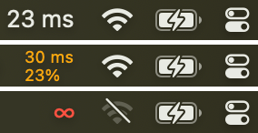

# AutoPing

AutoPing is a macOS menu bar widget that shows the current quality of your internet connection.
It measures connection quality using a weighted average of ping durations and percentage of failed
pings, calculated over the previous 30 seconds. Inspiration for this program was drawn from a
[similar application](https://web.archive.org/web/20160410212547/https://itunes.apple.com/gb/app/autoping/id632347870?mt=12)
which was published in the 2010s by Memset and is no longer available.

AutoPing uses the [Sparkle 2 framework](https://sparkle-project.org/) framework to manage updates.
If the "Automatically download" option is selected, updates will happen in the background and become
operational upon restart of the application or the computer. If this option is not selected, the
background color of the menu bar widget will turn orange when updates become available, prompting users
to select the "update to \<most recent version\>" menu item to update it.

## Installation

To install, please download a .dmg file from the latest release at [https://github.com/alexkhesin/AutoPing/releases](https://github.com/alexkhesin/AutoPing/releases).

Select "Launch at Login" in Preferences to continue running after a reboot.

Minimum required macOS version is 15.5 (due to what I am running on my laptop).
Happy to take contributions that make it work on earlier versions.

